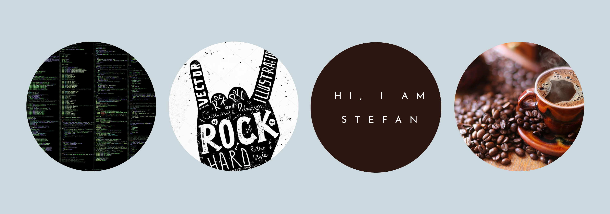

  

### I'm a Husband, Father and Developer!

- 🌱 I’m currently learning LAMP
- 👯 I’m looking for a great team - aka job
- 🥅 2020 Goals: Find a job, work on personal projects

### Languages and Tools:

 

### Connect with me:

[][twitter]
[][facebook]
[][linkedin]

 

---

### 📕 Latest Blog Posts
<!-- BLOG-POST-LIST:START -->
- [First steps in Dev world](https://dev.to/stefandurlesteanu/first-steps-in-dev-world-64g)
<!-- BLOG-POST-LIST:END -->

---

  
:zap: GitHub Stats

  

[twitter]: https://twitter.com/DrlStefan
[facebook]: https://www.facebook.com/stefan.durlesteanu.5
[linkedin]: https://www.linkedin.com/in/stefan-d-837bb1193/

